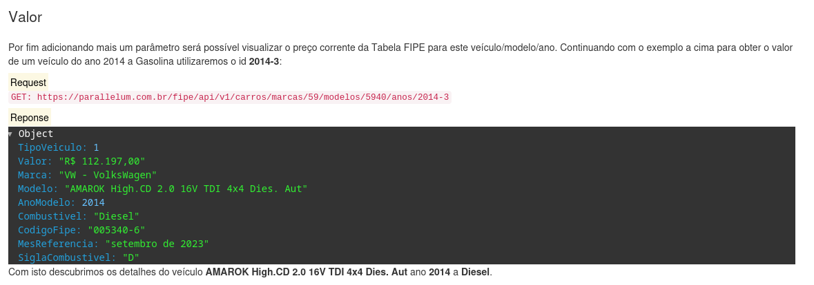
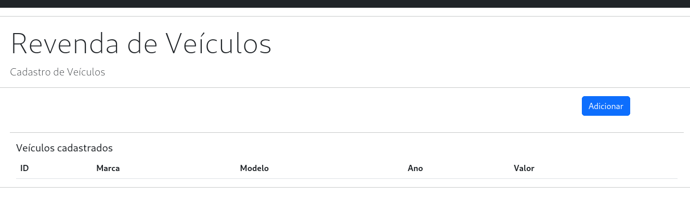

# Cadastro de carros para revenda

Cadastro para registro de carros usados disponíveis para venda, consumindo dados da API da FIPE para consulta de descrição do veículo e valor médio de revenda.

## Features

- Permite criar e deletar carros;
- Considera os campos de marca, modelo, ano e valor de revenda;

## Tecnologias utilizadas

- Python: Linguagem de programação utilizada no back-end;
- Flask: Framework web para construção da aplicação;
- SQLAlchemy: Biblioteca de Object-Relational Mapping (ORM);
- OpenAPI: Para escrever, produzir, consumir e visualizar serviços da API;
- HTML: Linguagem de markup do front-end;
- Bootstrap: Framework que fornece estruturas de CSS para criação de aplicações front-end;
- Javascript: Linguagem de programação de comportamento que permite a criação de conteúdo dinâmico;
- Postgres: Sistema gerenciador de banco de dados relacional utilizado para persistência dos dados;

## Instalação

Instruções para instalação abaixo, considero que o Python versão 3 está devidamente instalado e que o módulo pip e virtualenv estão configurados.
Docker também é uma premissa para rodar os Dockerfile atribuídos a cada componente.

O sistema foi desenvolvido conforme imagem abaixo.

O Componente C é responsável pela persistência dos dados do sistema.
O Componente A1 é uma API desenvolvida em Flask e controla as rotas de leitura, inserção, deleção dos registros.
O Componente A2 é uma pagina HTML com JavaScript responsável pela leitura e edição dos dados no banco de dados.
O Componente A3 é uma visualização que simula um site de revenda dos veículos previamente cadastrados, utilizando apenas as rotas de leitura de carros e adição de transação de venda.
O Componente B é uma API externa, grátis e sem chave de acesso, que disponibiliza informações de veículos (marcas, modelos, valores) capturados da tabela FIPE.

### Componente C

O Componente C é uma instância do SGBD Postgres e é responsável pela persistência dos dados.
É o primeiro componente que deve ser executado, uma vez que os outros componentes dependem do banco de dados para correta inicialização.

Baixar uma imagem do SGBD Postgres
``` shell
sudo docker pull postgres
```

Criar uma rede que será compartilhada entre os contâiners para comunicação dos dados
``` shell
sudo docker network create mynetwork
```

Inicializa um contâiner a partir da imagem baixada previamente.
``` shell
sudo docker run --name postgres-container --network mynetwork -e POSTGRES_PASSWORD=1234 -e POSTGRES_DB=revenda -p 5432:5432 -d postgres:latest
```

A partir da correta inicializaçao desse container podemos seguir para os próximos componentes.
O SGBC é inicializado sem nenhuma estrutura de tabelas, que é criada posteriormente a partir da primeira execução da API com os modelos de dados.

### Componente A

O Componente A é uma API desenvolvida em Flask e é responsável pela comunicação com o banco de dados.

Acessar a pasta api, com os arquivos da API de conexão com o banco de dados.


Construir uma imagem a partir do Dockerfile
``` shell
sudo docker build -t api .
```

Inicializa o container da API, considerando 
``` shell
sudo docker run -p 5000:5000 --network mynetwork api
```


### Componente B

### Utilização

### Cadastro 

Após execução dos passos de configuração e inicalização do serviço, basta executar o arquivo "index.html" dentro do diretório "front".

### Para listar os projetos

1. Os projetos são listados por padrão na tela inicial, em formato de tabela e ordenados pela data de criação;

### Para inserir novo projeto



1. Clicar no botão "Novo" para mostrar o formulário de cadastro de novos projetos;

2. Registrar as informações do projeto:
- Projeto: Nome do projeto, com até 100 caracteres;
- Descrição: Descrição resumida do projeto, com até 4000 caracteres;
- Início: Data de início do projeto, formato DD/MM/YYYY;
- Fim: Data estimada de finalização do projeto, formato DD/MM/YYYY;
- Categoria: Caixa de seleção, considerar observação abaixo;
- Gerente do projeto: Caixa de seleção, considerar observação abaixo;
- Status: Caixa de seleção, considerar observação abaixo;

```
Observação: O script de inicialização executa um arquivo python db_init.py que insere alguns registros de exemplo nas tabelas de apoio que populam as caixas de seleção. Caso o script não seja executado, faz-se necessário a inserção manual de registros nas tabelas de Categoria, Gerente e Status para que as caixas de seleção sejam preenchidas.
```

3. Clicar no botão "Adicionar" para incluir esse registro no banco de dados;

4. O registro deve aparecer na tabela abaixo do formulário;

### Para deletar um projeto



1. Identificar a linha que precisa ser excluída;

2. Clicar no botão "Del" referente a linha;

3. Confirmar a ação na mensagem de alerta;

4. O registro foi excluído no banco de dados e não deve aparecer na tabela após a atualização automática da tela;
