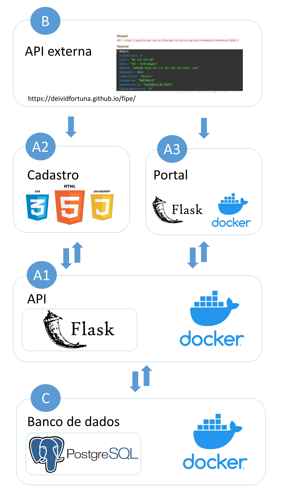
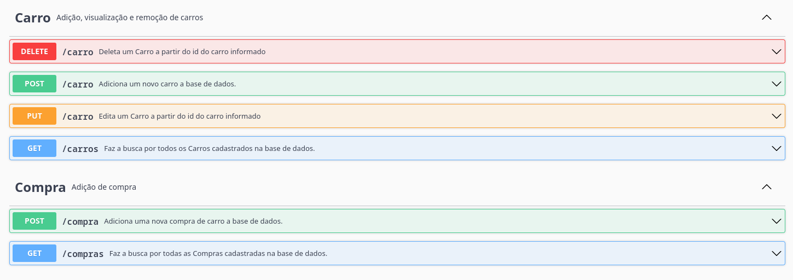
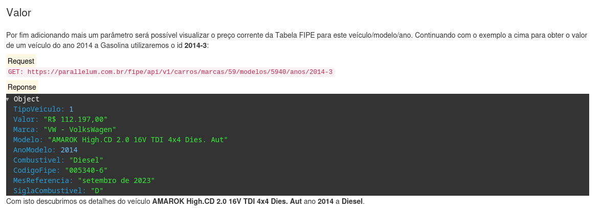
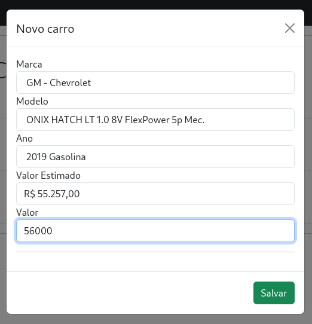
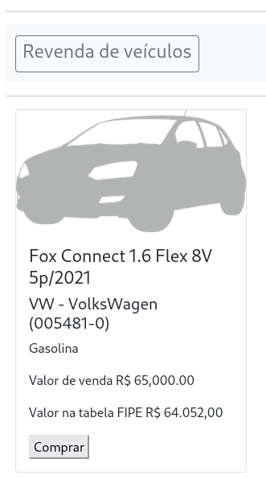

# Cadastro de carros para revenda

Cadastro para registro de carros usados disponíveis para venda, consumindo dados da API da FIPE para consulta de descrição do veículo e valor médio de revenda.


## Features

- Permite criar e deletar carros;
- Considera os campos de marca, modelo, ano e valor de revenda;


## Tecnologias utilizadas

- Python: Linguagem de programação utilizada no back-end;
- Flask: Framework web para construção da aplicação;
- SQLAlchemy: Biblioteca de Object-Relational Mapping (ORM);
- OpenAPI: Para escrever, produzir, consumir e visualizar serviços da API;
- HTML: Linguagem de markup do front-end;
- Bootstrap: Framework que fornece estruturas de CSS para criação de aplicações front-end;
- Javascript: Linguagem de programação de comportamento que permite a criação de conteúdo dinâmico;
- Postgres: Sistema gerenciador de banco de dados relacional utilizado para persistência dos dados;


## Instalação

Instruções para instalação abaixo, considero que o Python versão 3 está devidamente instalado e que o módulo pip e virtualenv estão configurados.
Docker também é uma premissa para rodar os Dockerfile atribuídos a cada componente.

O sistema foi desenvolvido conforme imagem abaixo.



* O Componente C é responsável pela persistência dos dados do sistema.
* O Componente A1 é uma API desenvolvida em Flask e controla as rotas de leitura, inserção, deleção dos registros de carros e compras.
* O Componente A2 é uma pagina HTML com JavaScript responsável pela leitura e edição dos dados de carros no banco de dados.
* O Componente A3 é uma visualização que simula um site de revenda dos veículos previamente cadastrados, utilizando apenas as rotas de leitura de carros e adição de transação de venda.
* O Componente B é uma API externa, grátis e sem chave de acesso, que disponibiliza informações de veículos (marcas, modelos, valores) capturados da tabela FIPE.

Os componentes C, A1 e A3 estão dentro de contâiners Docker.


### Componente C

O Componente C é uma instância do SGBD Postgres e é responsável pela persistência dos dados.
É o primeiro componente que deve ser executado, uma vez que os outros componentes dependem do banco de dados para correta inicialização.

Baixar uma imagem do SGBD Postgres
``` shell
sudo docker pull postgres
```

Criar uma rede que será compartilhada entre os contâiners para comunicação dos dados
``` shell
sudo docker network create mynetwork
```

Inicializa um contâiner a partir da imagem baixada previamente.
``` shell
sudo docker run --name postgres-container --network mynetwork -e POSTGRES_PASSWORD=1234 -e POSTGRES_DB=revenda -p 5432:5432 -d postgres:latest
```

A partir da correta inicializaçao desse container podemos seguir para os próximos componentes.
O SGBD é inicializado sem nenhuma estrutura de tabelas, que é criada posteriormente a partir da primeira execução da API com os modelos de dados.


### Componente A1

O Componente A1 é uma API desenvolvida em Flask e é responsável pela comunicação com o banco de dados.




Acessar a pasta api, com os arquivos da API de conexão com o banco de dados.

Construir uma imagem a partir do Dockerfile
``` shell
sudo docker build -t api .
```

Inicializa o container da API, considerando 
``` shell
sudo docker run -p 5000:5000 --network mynetwork api
```


### Componente A2

O Componente A2 é um cadastro em HTML e JavaScript utilizado para inserir/deletar novos carros na base de dados.
Os scripts em JavaScript buscam a informação de veículos cadastrados no SGBD Postgres e, a partir do valor dos campos de marca, modelo e ano, busca as respectivas informações detalhadas na API externa e preenche as caixas de seleção em sequência, considerando o input da caixa de selção anterior.


Para acessar, basta executar o arquivo index.html dentro da pasta frontend_cadastro.


### Componente A3

O Componente A3 é uma visualização dos carros previamente cadastrados pelo Componente A2, com uma funcionalidade que simula a compra do veículo selecionado.
A descrição dos campos vem a partir da API externa Componente B, além do valor estimado para o carro.
Veículos comprados não são mais visualizados pelo Componente A3.


Acessar a pasta frontend_revenda.

Construir uma imagem a partir do Dockerfile
``` shell
sudo docker build -t api .
```

Inicializa o container da API, considerando 
``` shell
sudo docker run -p 5000:5000 --network mynetwork api
```


### Componente B

API Externa que disponbiliza dados de veículos capturados do portal da FIPE Fundação Instituto de Pesquisas Economicas (https://www.fipe.org.br/).
A partir dos dados dos carros previamente cadastrados, conseguimos construir um endereço de REQUEST no último nível de acesso da API.
O REPONSE resultante é utilizado nos componentes A2 e A3. 



Link de acesso: https://deividfortuna.github.io/fipe/ .


## Utilização

### Cadastro de carros (Componente A2)

Após execução dos passos de configuração e inicalização do serviço, basta executar o arquivo "index.html" dentro do diretório "frontend_cadastro".


#### Adição


O botão adicionar abre uma janela modal com um formulário que permite a adição de um novo carro.



Deve-se observar a ordem de preenchimento, uma vez que as caixas de seleção são atualizadas sequencialmente.
Primeiro a Marca, na sequencia o Modelo e finalmente o Ano.

A adição é concluída a partir do clique no botão "Salvar" ao fim do formulário.


#### Deleção

Para deletar um carro, basta clicar no respectivo botão "del" e confirmar na mensagem de alerta.


### Site de revenda (Componente A3)

A partir da execução do respectivo contâiner do Componente A3, podemos acessar o site de revenda no endereço abaixo.

http://127.0.0.1:5001/carros

Para simular uma compra, basta clicar no botão "Comprar".



O não deve aparecer novamente no site, uma vez que filtramos pela API os carros que possuem um processo de compra.